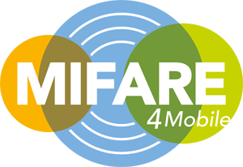

# Data Science Portfolio
---
## Machine learning

### Fraud Detection

> Fraud detection is a set of processes and analyses that allow businesses to identify and prevent unauthorized financial activity. This can include fraudulent credit card transactions, identify theft, cyber hacking, insurance scams, and more.

 

## Lending Club Case study

> In this case study, you will use EDA to understand how consumer attributes and loan attributes influence the tendency of default.
> If one is able to identify these risky loan applicants, then such loans can be reduced thereby cutting down the amount of credit loss. Identification of such > applicants using EDA is the aim of this case study!

 

## AIS for Incentive And Rebates Automotive data 
> Project involved working on the products which provide automatic information of Incentive And Rebates Automotive ,to fill the gap Between 
Dealers and Consumers. We are developing a methodology for measuring the accuracy of the data used to calculate the price and payment that is presented through DSP tools.

 

## Automatic Validation of Biometric Access Terminals
> Project involved working on the product series that provided an innovative and effective solution for access control applications using fingerprint verification and identification. The product family supports different contactless cards also.It involved automation of very basic finctionality test of product series , using Universal Robot 3. 

 

## Mifare4Mobile
> Project involved technical implementation of MIFARE4Mobile framework which provided mobile network operators, trusted service managers, and service providers with a single interoperable programming interface to remotely manage MIFARE product-based services in SIM cards of mobile NFC devices over the air.

 

## eSE-Mifare
> Project involved technical implementation of Mifare (Classic and Desfire) in embedded Secure Element.

 

## Cell Tick -LiveScreen
> Project involved working on a toolkit application present in SIM card. It had features such as displaying active messages on mobile home screen, delivering location aware services, and providing dynamic menu management.

